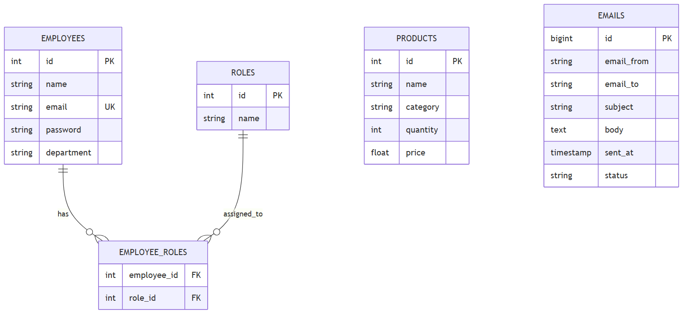

# Projeto Final Back-End - Papelaria

API REST desenvolvida como projeto final do curso de backend (SENAI / FIRJAN). O sistema gerencia produtos, controle de estoque basico, cadastro de funcionarios com controle de acesso, envio de e-mails e upload de imagens.

## Tecnologias Utilizadas

- Java 17
- Spring Boot 3
- Spring Data JPA / Hibernate
- Spring Security (HTTP Basic e criptografia com BCrypt)
- MySQL / H2 Database
- SpringDoc OpenAPI (Swagger UI)
- Spring Mail
- Maven

## Funcionalidades

- Cadastro, listagem, edicao e exclusao de produtos
- Cadastro e gerenciamento de funcionarios
- Controle de permissoes (perfis ADMIN e USER)
- Envio de e-mails de notificacao
- Upload e armazenamento de fotos em disco local
- Documentacao interativa de rotas via Swagger

## Modelo de Dados

O banco de dados e estruturado com entidades em ingles seguindo o padrao da aplicacao:
- Employee: dados cadastrais, credenciais de acesso e departamento
- Role: niveis de acesso atribuidos aos funcionarios (tabela associativa employee_roles)
- Product: informacoes de estoque, categoria, quantidade e preco
- EmailModel: registro de mensagens enviadas e status de entrega



## Como Executar o Projeto

### Pre-requisitos
- Java JDK 17 instalado
- MySQL instalado e rodando localmente (ou uso do perfil de testes com H2)

### Passos

1. Clone o repositorio:
```bash
git clone https://github.com/Wpnnt/projeto-final-backend.git
cd projeto-final-backend
```

2. Configure o banco de dados:
Por padrao, a aplicacao utiliza as configuracoes de `src/main/resources/application-dev.properties`.
Verifique se a base de dados `apispringboot` existe no seu MySQL e ajuste o usuario e a senha conforme o seu ambiente local.

Para rodar com banco em memoria H2 (sem necessidade de instalar MySQL), altere em `src/main/resources/application.properties`:
```properties
spring.profiles.active=test
```

3. Execute a aplicacao:

No Windows:
```bash
.\mvnw.cmd spring-boot:run
```

No Linux ou macOS:
```bash
./mvnw spring-boot:run
```

Ou execute a classe `BackendApplication` diretamente pela sua IDE (Eclipse, IntelliJ ou VS Code).

## Documentacao da API

Com a aplicacao rodando, acesse a documentacao interativa das rotas pelo Swagger:
- http://localhost:8080/swagger-ui/index.html

### Principais Endpoints

| Metodo | Rota | Descricao |
| --- | --- | --- |
| GET | /products | Lista todos os produtos cadastrados |
| GET | /products/{id} | Busca produto por ID |
| POST | /products | Cadastra um novo produto |
| PUT | /products/{id} | Atualiza dados de um produto |
| DELETE | /products/{id} | Remove um produto |
| GET | /employees | Lista os funcionarios cadastrados |
| GET | /employees/{id} | Busca funcionario por ID |
| POST | /employees | Cadastra um novo funcionario |
| PUT | /employees/{id} | Atualiza dados de um funcionario |
| DELETE | /employees/{id} | Remove um funcionario |
| POST | /send-email | Dispara envio de e-mail |
| POST | /photos | Realiza upload de foto |

## Autores

- [Paulo Vitor](https://github.com/Wpnnt)
- [Rodrigo Duarte Silva](https://github.com/rodrigoduartesilva)
- Odara Jara
- Bryan
